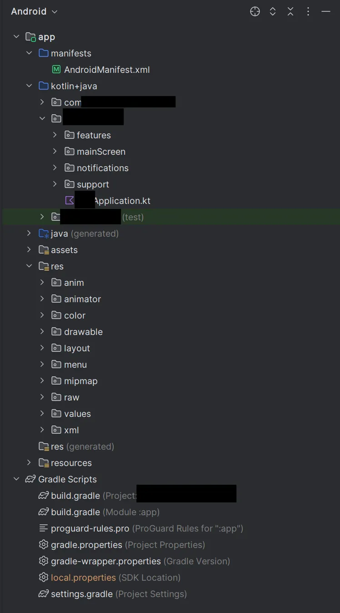

+++
date = '2024-10-16T13:27:12-06:00'
draft = false
title = 'Android Crash Course for Beginners - pt. 2'
categories = ["Android Crash Course"]
+++

## Overview

Welcome to part 2 of this Android crash course series (Part 1 is [here](/posts/crash-course-android)). At this point, you should be relatively familiar with how Android creates and runs applications. You don't need to know every detail about it: in fact, you could easily argue that you don't need to know anything from the last post. I would argue, however, that having a solid foundation on which to build your development skills will help you tremendously.

The goal of this post is to get you comfortable with working on an existing Android app. This means you'll get to know what the different parts of the source code are and how to add to it. Let's get started!

## Setting up Your Development Environment

This may vary depending on your organization’s practices, but the general steps would be:

1. Install Android Studio

2. Clone the Repository where the Android code lives

3. Obtaining a Google Services JSON file for access to Google APIs (e.g. Google Maps)

4. Generate and upload a SHA-1 key to accompany the JSON file

5. Run the app by connecting your phone or downloading an emulator

## The Concept of Components

I want to talk a bit about how an an Android app is structured in the abstract.

If you’re familiar with API development, you know that each endpoint for an “app” - `/home`, `/contact`, and `/person` for example - functions entirely separate from the others. They have shared libraries and similar code, but you can easily imagine them as separate processes.

“Apps” in Android are very similar: they have different types of “endpoints” you can access, called Components. Some of them are visual and interactive, like a home screen, but others can run in the background. Components are grouped into 4 categories:

 - **Activities**: The visual screens you interact with. An app can have several activities, or just one: whichever is best for the developer’s use case. These are started via the home screen icon or from other apps.

 - **Services**: Runs in the background, e.g. playing music even after the app screen is closed.

 - **Broadcast Receivers**: Runs when some system condition is met, e.g. time passing or a low battery

 - **Content Providers**: Provides data that other apps might want to use. This is a literal endpoint in that apps can query the URL `content://your.app.name/datatype/data` and get the data you provide.

To start another component, even those in the same app, requires an explicit call with instruction data stored in an object called Intent. Think of it like calling `http://localhost/someOtherEndpoint`. Android puts this other activity on the call stack, and when it closes it returns data you requested. For more in-depth information, Google has [a great introduction page](https://developer.android.com/guide/components/fundamentals.html) covering all these process types.

The Android operating system knows which endpoints/components are available via the AndroidManifest.xml file shipped with every Android App.

## Activities and their Displays

Activities are the most familiar type of component, since those are the ones we can see visually. Let’s look at a simple one, working our way from the Android Manifest. In the app/src/main/AndroidManifest.xml file, you’ll find something like this:

```xml
// A bunch of blocks here.... 

<activity
 android:name=".path.to.your.MainActivity"
        android:icon="@drawable/ic_your_icon"
        android:label="@string/your_label"
        android:launchMode="singleTop"
        android:parentActivityName=".mainScreen.MainActivity">
        <meta-data
            android:name="customDescription"
            android:value="@string/person_description" />

</activity>

// More XML here...
```

The `<activity>` block lets Android know that this is an endpoint we want to expose to other components/the user. The data inside it is useful information for the activity caller and the Android OS:

 - **android:name** - where the “main” class for the Activity lives. When called, the class’ onCreate() function is run.

 - **android:icon** - icons other activities can display to the user to show what it is

 - **android:label** - like icon, but text.

 - **android:launchMode** - If we think of activities like webpages, this sets how the tab history gets changed when the activity is loaded. The different options are slightly different in weird ways, but [this Medium article](https://medium.com/android-news/android-activity-launch-mode-e0df1aa72242) explains it well.

 - **android:parentActivityName** - tells Android what activity to go to if the "back”[^1] button is pressed.

 - **\<meta-data\>** - data that other components might use, but not by Android.

Now that Android knows the data about how to launch the activity, let’s look at the code for the activity itself, stored in the file referenced by android:name. It’ll look something like this:

```kotlin
package com.yourcompany.path.mainActivity

import ...

class MainActivity: AppCompatActivity() {
    
    companion object {
      ...
    }

    override fun onCreate(savedInstanceState: Bundle?) {
        super.onCreate(savedInstanceState);
        setContentView(R.layout.main_activity);
        ...
    }
...
}
```
The parent AppCompatActivity class lets you create an activity with newer API features on older devices (See [this StackOverflow](https://stackoverflow.com/questions/67891362/componentactivity-vs-appcompatactivity-in-android-jetpack-compose) for more on that). Essentially, if you have a non-Jetpack Compose app (more on that later) or use Fragments, you use AppCompatActivity rather than the base ComponentActivity.

The companion object is Kotlin’s “improved” way of doing static variables. Think of it as a Singleton object that all instances of the Activity class have reference to.

onCreate is the “main” function that gets called when launching the Activity. There are a lot more lifecycle functions you can implement and call, like onResume or onStop. The interactions between the lifecycle states can be hard to wrap your head around, but reading [the Android docs](https://developer.android.com/reference/android/app/Activity#activity-lifecycle) a few times should help.

[A bundle](https://stackoverflow.com/questions/4999991/what-is-a-bundle-in-an-android-application) is a way to pass data between Components. Think of it like the body of a POST request: Without it, the activity has no data to work off of that it might need. Note that to *start* an Activity requires an Intent object, which can contain a bundle.

We now get to setContentView, which in the example above is passed an XML file (referenced with R.layout.main_activity). This way of describing how we want the Activity to look with an XML file is called the XML Layout style. It has been superseded by Jetpack Compose, a way to create the visual layout with code. Instead of `setContentView(R.layout.main_activity)`, you would write something like

```kotlin

setContent { // In here, we can call composables!
            MaterialTheme {
                Greeting(name = "compose")
            }
        }
```

Where you call the setContent() function. You may wonder how using curly brackets is calling a function. Kotlin has a shorthand way of calling functions with functions called Trailing Lambda Syntax. Essentially, if you:

 - Are calling a function that takes a reference to another function

 - That function reference is the only parameter, and

 - You want to write the passed function right then & there

You can write the function you would pass in lieu of using the regular parentheses for the other function. More details can be found [here](https://kotlinlang.org/docs/lambdas.html).

What you’re passing in to setContent(View), either by XML or Compose, represent objects called Views. These correspond pretty directly to HTML elements like div, button, etc.

## The Other Bits

Android with Kotlin has a lot of other quirks and syntax weirdness that I’m not going to cover here. That being said, I do want to quickly cover the concept of contexts:

 - Context is the super class that Application and Activity inherit from. It has the methods you use to make a lot of system-level calls, such as:

     - showing a dialog

     - starting an activity

     - starting a service

     - loading resources

Because it's a parent class, when you start an activity from another activity you just call this.startActivity() which uses the parent Context's startActivity function. Since the Activity's parent Context and the Application's parent Context have different lifetimes (the Activity's Context life is shorter than the Application's) referencing an Activity's Context somewhere that lives longer than the Activity (e.g. in the "static" companion object) can cause memory leaks! This Medium article goes more in depth on how Context works.

Other things that are important but I don’t feel like writing about right now (let me know if you want me to, and I just might!) are:

 - Binding

 - ViewModel

 - StateFlow/MutableStateFlow (basically a stream, like ports kinda?)

 - coroutines & scope

 - by keyword

## RecyclerView

I'd like to go a bit more in-depth on the [RecyclerView](https://developer.android.com/develop/ui/views/layout/recyclerview), since it'll give a nice example for dealing with Views in general as well as preparing you for writing a simple app.

Something apps do a lot is take a list of data and display that as a scrollable list. How could we implement that ourselves? We might need

 - Data stored in the Activity as some sort of object

 - A View that represents a single list item

 - A Parent View that groups all the list item Views

 - Some way to connect the list item View to the data we want to display

We can start by making a layout xml file for the individual list item, which we can call a ViewHolder (since it holds data), and the group container view which we can call a RecyclerView. 

What would be nice is if the RecyclerView object had a method that accepted a data object it would use to generate the ViewHolders and their data. Turns out, there is!

```kotlin
myRecyclerView.setAdapter(myAdapter)
// or myRecyclerView.adapter = myAdapter;
```

`myAdapter` is an object of a class that extends `RecyclerView.Adapter`. There are three functions you need to implement in order for the RecyclerView to have enough information to generate the needed ViewHolders:

 - `onCreateViewHolder`: Called when the RecyclerView needs to generate a new ViewHolder. You return your ViewHolder object here.

 - `onBindViewHolder(yourViewHolder, int_position)`: Called when the RecyclerView needs to add data to the given ViewHolder.

 - `getItemCount`: Called so the RecyclerView knows how much data there is for implementation reasons.

Those are the three functions required to extend `RecyclerView.Adapter`, but if you want to modify the data you'll need more functions to actually do that. A utility RecyclerAdapter might have data functions like: `add, addAll, remove, replace, set`, and a few more.

We can see that onBindViewHolder implies that the ViewHolder needs a way to add the data to the View bits (be it text, images, etc). There isn't a set way to do this, but one approach is with a `bind()` function which gets called in utility Recycler Adapter’s onBindViewHolder implementation.

## The Code Structure

The vast majority of the time, you'll be in the "Android" file view in Android studio. It'll look something like this:



The code is stored in the `kotlin+java` folder, and everything else will be in the res folder (things like XML, images, etc.).

The `kotlin+java` folder has three subdirectories: `com.cuberto.liquid_swipe`, `com.yourcompany` and `com.yourcompany (test)`. The `liquid_swipe` directory is just code snippets that enable the cool image swipe-through when you first install the app. The test directory is for writing tests (obviously) and the `com.yourcompany` directory is where the meat of the app's code is. Inside this example directory is:

 - `features`: Different feature sections of the app

 - `mainScreen` has everything that isn't a feature. This includes the "main screen" but also things like the settings activity, shortcut activity and the editing widgets activity.

 - `support` has utility code you use to build the rest of the app. You can think of it like a 3rd party library you can edit.

 - `YourApplication.kt` has the `Application` subclass code that runs before every component. It does three things:

1. Adds crash logging with Dynatrace

2. Adds a reference to the Application's Context in the AppContext object, accessible by any Activity.

3. Sets the app's theme to whatever the user had set previously (or the system default, if none set) by calling `AppCompatDelegate.setDefaultNightMode` via `applyTheme`. This makes the system pick either the light or dark value set in res/values/styles.xml. 

## The Utility Classes

Although the default Android classes have great default behaviors, there are some things we'd like to run and have access to for our specific use case. That's why having your own utility classes is super helpful. You might have all your activities extent UtilityActivity instead of Activity directly, for example. Here's a quick overview of what these could look like:

### UtilityLogger

A simple singleton object that stores logs in its private `logs` attribute. You add a log with `log()` and retrieve logs with `getLogs()`. 

### UtilityActivity

Has a reference to a UtilityViewModel.

On startup, this generates a log using UtilityLogger letting you know the activity was created. It also starts a coroutine that watches for changes to the UtilityViewModel's loadingStateFlow. If you set it to `LOADING`, UtilityActivity displays a progress bar. If you set it to anything else, it removes it.

Some useful functions it comes with:

 - `useDefaultBrowser(uri: Uri)`: Opens a URL in the default browser

 - `openUrl(url: String, messageIfAppMissing: String)`: Opens relevant activity for a given content URL (e.g. Contacts app for contact URL)

 - `showGoogleMapsDialog(latitude: Double, longitude: Double)`: Opens Google Maps to the specified latitude/longitude

 - `startChromeTabView`: If you want to open a web URL but not open the browser, this displays the webpage as something called a [Custom Tab](https://developer.chrome.com/docs/android/custom-tabs).

 - `showAlertDialog`: Shows an alert with the given text.

### UtilityRecyclerActivity

A child class of UtilityActivity that has a RecyclerView by default. To access the parts of the view, it comes with some parameters you can access:

 - `viewSwitcher`: The recyclerView and textView

 - `recyclerView`: The recyclerView inside viewSwitcher

 - `textView`: the textView inside viewSwitcher

Here’s a few other utility classes you might want to write:

 - UtilityViewModel

 - UtilityRequestManager

 - UtilityCallManager

 - UtilityViewHolder

That’s it for this post. Hopefully with this and the previous articles you have a stronger intuition for how Android works both under the hood and from a developer’s viewpoint. If I have time to dive in further I might fill in more of the blanks (no guarantees…).

[^1]: Technically it’s what happens when the “Up” button, not “Back” button, is pressed. From what I can find, though, they are pretty much the same thing.