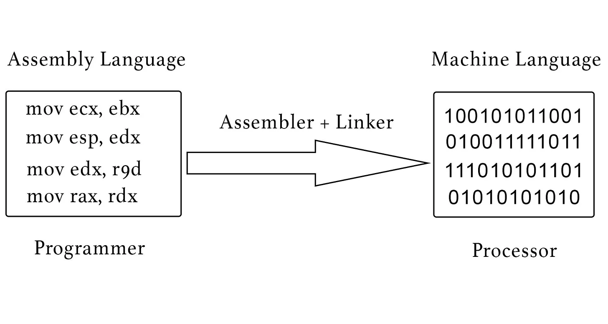

+++
date = '2024-10-04T13:27:12-06:00'
draft = false
title = 'Android Crash Course for Beginners - pt. 1'
categories = ["Android Crash Course"]
+++

## Overview

The goal of this crash course is to make you comfortable working on an existing Android codebase. While no previous Android experience is required, I assume some familiarity with:

 - Using an IDE (Using CLion/Pycharm helps the most, but VSCode works as well)

 - C/Java-like languages. You don't need to be an expert, just know most of the basic concepts

 - Basic knowledge of Git/GitHub

## Background Knowledge

To make sure we have all the background information required, I'll start at the very bottom of the [knowledge tree](https://waitbutwhy.com/2017/04/neuralink.html?) and quickly work our way up.

Computers process instructions on their central processing units, CPUs. Through magic[^1], they read these instructions from memory and execute them. These instructions may be something like “add 2 numbers”, “store this number in memory”, etc.

The CPU's instructions look like this:

```binary
01000110
01001001
01001010
```

That's not very readable. At all. To actually write programs as humans we introduce our first abstraction, assembly:



That text on the left (e.g. mov ecx, ebx) corresponds directly to a sequence of 0's and 1's (e.g. 100101011001). A mini program takes our "text" file with these semi-readable instructions and converts them to machine language.

This is still really awful to program in. Even worse, different CPUs have different sets of instructions they can use! It would be really nice to have a program that takes easy-to-write code and converts them to the relevant machine instructions. This is what languages like C, C++ and Rust do: you write code and a [compiler](https://stackoverflow.com/questions/4156547/is-there-a-simple-explanation-of-what-a-compiler-is) transforms it into the instruction set your CPU understands. If you have multiple CPUs you're making programs for, it can create different instruction set files.

Unfortunately, there is another layer in between your code and, say, displaying a window on your monitor: the Operating System (OS). Different Operating Systems like Windows or MacOS have different ways of interpreting machine linstructions. What if there was a way to code just one, high-level, generic command (e.g. `createWindow()`) and have it Just Work<sup>TM</sup>?

Enter Virtual Machines. These are programs that take their own special kind of machine instruction, called bytecode, and convert it on-the-fly to the underlying machine's instruction set. This means instead of compiling your code to a bunch of different instruction sets, you compile it to one bytecode file and have the virtual machine run it for you! At the cost of a little performance, we get code that's [write once, run anywhere](https://en.wikipedia.org/wiki/Write_once,_run_anywhere).

This is, at the very base level, how Android works: You write code in a high-level language (~~either Java or~~ Kotlin) that compiles to bytecode. This bytecode is then run on a virtual machine running on your phone and executed!

If you're familiar with Java, then you know that I just described how Java works with the JVM, or the Java Virtual Machine. Android has its own (very similar) version of the JVM called Dalvik[^2]. You can read more about Dalvik bytecode, which has the file extension .dex, in [this StackOverflow answer](https://stackoverflow.com/questions/28663243/does-the-android-system-include-a-jvm).

That’s how code gets compiled to be usable on an Android device. What you actually download from Google Play is a .APK file, which is your Dalvik bytecode along with all your app's assets (e.g. images). For more information on APK files, click [here](https://android.stackexchange.com/questions/174435/why-does-android-keep-apk-files-of-installed-apps).

## Gradle

We now have enough knowledge to start understanding an Android Repo. The scariest part of the repo are those related to Gradle, the build tool that orchestrates how your code gets turned alchemy-like into APK files. It becomes much less scary when you realize that Gradle is just a shortcut for running the build/compile/deploy commands every time.

I *highly* recommend reading through [Gradle's introduction documentation](https://docs.gradle.org/current/userguide/userguide.html). It's well written and easy to follow. Here's a summary:

 - Gradle is a way to describe functions to do things (e.g. build the project, run on a device, etc.) using either a version of Kotlin or a language called Groovy. These functions are called *tasks*.

 - You can specify which folders the tasks are applied to in a settings.gradle file. Gradle calls these different directories *modules*.

 - You don't have to write every single task yourself: You can install packages, which are Gradle tasks someone else wrote.

 - You run a Gradle function by running `./gradlew` X in your terminal (`./gradlew.bat X` for Windows), where `X` is the name of your task. 

 - `gradlew` is the Gradle Wrapper, which makes sure Gradle is installed before running your command. You can see the list of tasks you can run with the Gradle Wrapper by running `./gradlew tasks` in your terminal.

 - When run, Gradle first checks the `settings.gradle` file to see which modules it should run the task against. In the example below, `settings.gradle` says that it should apply tasks to the project in the /app directory:

```gradle
include ':app' // in the settings.gradle file
```

 - Gradle then runs the `build.gradle` in the top-level directory. The `buildScript` block tells it some Gradle configurations, such as which versions of kotlin to use and packages it will use. The `allpackages` block which adds configuration for any sub-projects such as where to download dependencies.

 - Gradle then checks the `build.gradle` in the sub-projects specified in `settings.gradle`. At the top of `app/build.gradle` you might see `apply plugin: 'com.android.application'` which installs the Android Gradle Plugin. This installs the build task that runs when you click the green play button in Android Studio.

 - The android block in `app/build.gradle` configures the Android build task. The `dependencies` block lists all the Kotlin code your app depends on.

For more information about Gradle's structure, check out [Google's documentation](https://developer.android.com/build/gradle-build-overview) on the subject.

## Project Overview

Taking a high level look at the repo, there’s a lot of files and folders! Luckily, we’ve gone through a bunch of them by understanding Gradle. Here are some other ones you might encounter:

 - `/.github/workflows/`: Where GitHub actions are stored. These are a whole topic on their own but aren't relevant to Android development, so I'll skip over this.

 - `/app/`: Where our actual app code is stored.

 - `/fastlane/`: Fastlane is an automation tool to automatically deploy our app to the Google Play store.

 - `/gradle/wrapper/`: Where the JVM bytecode used by the Gradle Wrapper is stored, as well as a config file telling it where to download Gradle.

 - `.gitignore`: This tells git which files not to track.

 - `Gemfile and Gemfile.lock`: If you've used javascript this is the package.json (or requirements.txt for python) equivalent for Ruby, which Fastlane uses.

 - `gradle.properties`: Gradle specific settings, e.g. the stack size used

 - `requirements.txt`: Dependency management for automated testing with Appium.

## How an Android App Runs

We know that Gradle directs the process of converting your code & assets into a .APK file. What does that look like?

It turns out, a .APK file is just a ZIP file with specific files/directories! As described in [the link above](https://android.stackexchange.com/questions/174435/why-does-android-keep-apk-files-of-installed-apps) or the [Wikipedia article](https://en.wikipedia.org/wiki/Apk_(file_format)), the file directory structure inside a .APK file looks like this:

 - `assets/`: files (e.g. images, sounds, icons) that you can access just like any regular file

 - `res/`: Like assets, but you can access the files in code with R.id.YOUR_ID from your code. More flexible for multi-language apps.

 - `META-INF/`: cryptographic signatures for the app, used by Google Play to verify it hasn't been tampered with

 - `lib/`: Pre-compiled machine code for your dependencies you list in the build.gradle. Think of these like .dll files.

 - `AndroidManifest.xml`: What the Android OS uses to see what Activities/Services are available (explained below)

 - `classes.dex`: Your code compiled to DEX bytecode

If you're familiar with Java or C code, you know that you need a main method that tells the app where to start. However, an Android App is more like a loose collection of separate processes/screens that we call Activities (I’ll go more in depth in a future post). What happens in Android to detect “main” methods is (essentially) the following:

 - An app makes a call to start an Activity, or someone clicks on the app in the homepage

 - Android looks in the AndroidManifest.xml for an activity with that name

 - Android looks at the relevant part of the `classes.dex` file that contains the code for the class described in the Manifest's `android:name` section. For more information on the `.dex` file format itself, see [this Google blog post](https://cloud.google.com/blog/topics/threat-intelligence/dalvik-look-into-dex-files).

 - If called from an activity not in the app, it runs the onCreate() function in the class named in the `<application>` block's `android:name`.

 - Finally, it looks for and runs the relevant activity's onCreate() method, which acts as its main function.

> Note: this is an oversimplification, since Android doesn't directly run dex code and instead runs the ART machine-compiled version. That being said, going to this level of detail is more than sufficient to understand the inner workings of Android apps.

That second step explains why you would need to put the Activity class in `AndroidManifest.xml`: if they're not declared there, the system can't find it!

## Code Compilation

There aren’t too many resources out there explaining the compilation step (that I had time to get through, anyway), but from what I understand it goes something like:

1. The [AAPT (Asset Packaging Tool)](https://stackoverflow.com/questions/28234671/what-is-aapt-android-asset-packaging-tool-and-how-does-it-work) compiles Layout XML stuff into R.java, a list of resource ids

2. [kotlinc](https://kotlinlang.org/docs/command-line.html) converts Kotlin code into .class files

3. [D8](https://developer.android.com/tools/d8) converts .class files into one .dex file

4. The .APK is signed, built, and loaded onto a testing device

For more information [this Medium post](https://shishirthedev.medium.com/build-process-in-android-8c955d6467b8) has some good jumping-off points.

## Conclusion

Almost everything you need to know after this relates specifically to Android *development* and how to make the apps. Hopefully, you're much more comfortable with how Android works and the general file structure of this repo. I unfortunately can't fit everything I want to in one post, so I will leave the development crash course page for another day. If you have any questions or suggestions on how to improve this article, please comment down below!

[^1]: To understand the magic, take [CS 240](https://catalog.byu.edu/courses/09200-000).

[^2]: Dalvik was actually discontinued sometime in the 2010s and replaced with a much faster version called the [Android Runtime (ART)](https://en.wikipedia.org/wiki/Android_Runtime). That being said, the depth of knowledge required to understand going from your code to deploying on the app store stops as Dalvik.
