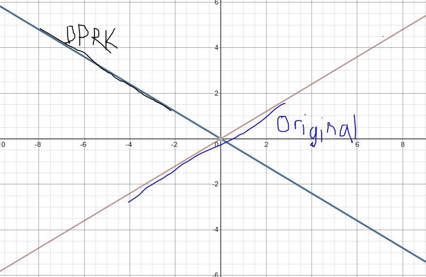

+++
date = '2021-03-16'
draft = false
title = 'Machine Learning Math Pt. 1 - Linear Transformations'
categories = ["Machine Learning Math"]
+++

I’m currently self studying Machine Learning from Ian Goodfellow et.al.’s Deep Learning book. They have a helpful introduction section with the math needed to understand the rest of the book, which I’m currently working my way through. What the ML Math posts are are basically my notes for the chapters. Which may or may not be helpful, I’m not sure. Anyways, here goes.  

Quick side note - implementing math is surprisingly easy in Hugo! It’s just linking to the mathjax cdn. There are a couple edge cases I had to deal with though. [This](http://xuchengpeng.com/hexo-blog/2018/07/10/setting-mathjax-with-hugo/) article helped a ton if you’re doing the same thing. Keep a watch out for line breaks though - because the character is \\\\ for new line, you need to escape the slashes, so it turns into \\\\\\\\ instead. Also, for linear transformations (what this post is about) [this](https://www.3blue1brown.com/essence-of-linear-algebra-page) youtube series by 3Blue1Brown was invaluably helpful. On with the math!

Some formatting guidelines - 
Vectors are bold lowercase, $ \mathbf{x} $   
Matrices are bold uppercase, $\mathbf{A}$  

To begin - vectors are a column of numbers:

$$
\begin{bmatrix}3\\\\5\end{bmatrix}
$$

You can think of these as arrows from the origin $(0,0)$ going to a point at coordinates $(x,y) = (3,5)$. 

But you also think of it in terms of two easy to think of vectors - the one pointing to (1,0) which we call i-hat ($\hat{i}$), and one pointing to (0,1) called j-hat ($\hat{j}$). Thus, we could also write the vector as:

$$
\mathbf{x} = \begin{bmatrix}3\\\\5\end{bmatrix} = 3\hat{i} + 5\hat{j}
$$

So, we see that we can represent our entire coordinate system as an addition of these two vectors, the “basis vectors.” Adding those two vectors is called a “linear combination.” Easy enough. Let’s take it up a notch!  

Imagine we have a foreign exchange student from North Korea, Kim. Over there, they don’t use our normal basis vectors going to (0,1) and (1,0). In fact, their basis vectors go to (-2,0) and (0,-2)! Kinda weird, but interesting. **Let’s see what a (3,5) vector would look like in North Korea!**
Our vector (3,5) is really just a scaling set of numbers - we scale $\hat{i}$ by 3 and $\hat{j}$ by 5. So let’s scale Kim’s vectors by our scaling values 3 and 5:

$$
3\begin{bmatrix}-2\\\\0\end{bmatrix}+ 5\begin{bmatrix}0\\\\-2\end{bmatrix}=\begin{bmatrix}3\times-2+5\times0\\\\3\times0+5\times-2\end{bmatrix}=\begin{bmatrix}-6\\\\-10\end{bmatrix}
$$

So a $(3,5)$ vector in North Korea looks like a $(-6,-10)$ vector for us. 
And that is what’s called a linear transformation! That is, translating/transforming a vector from one gridspace to another. We can do what we just did more succinctly by using matrix multiplication - 

$$
\begin{bmatrix}-2 & 0\\\\0 & -2\end{bmatrix}\begin{bmatrix}3\\\\5\end{bmatrix}=\begin{bmatrix}3\times-2+5\times0\\\\3\times0+5\times-2\end{bmatrix}=\begin{bmatrix}-6\\\\-10\end{bmatrix}
$$

Or more generally,

$$
\mathbf{A}\mathbf{x}=\mathbf{b}
$$

Where $\mathbf{A}$  is some $ m\times n $ matrix, $\mathbf{x}$  is an $ n\times p $ matrix, and $\mathbf{b}$ is an $ m\times p $ matrix.
Take some time to make sure this makes sense. You were probably taught matrix multiplication in school, but had no real intuitive feel for it (at least I didn’t). Hopefully you do now - you’re multiplying some scaling numbers on the left with the basis vectors of whatever coordinate system you want. 
You may be wondering what if A is just our normal basis vectors, i.e.

$$
\begin{bmatrix}1 & 0\\\\0 & 1\end{bmatrix}
$$
Well as you might have guessed, that does nothing, which makes sense - we’re seeing what a vector from our coordinate system would look like in... our coordinate system. That square matrix with 1’s on the diagonal has a special name - the “identity matrix,” which has the special property that multiplying it by any vector results in that same vector!

“Span” is the set of points you can reach by adding/scaling vectors. The span of $\hat{i}$ and $\hat{j}$ is the entire x/y plane, since you can reach any of those points by adding/scaling our two basis vectors. You can also have a span of a single vector. In this case, it’s the set of points you can reach by just scaling it. The span of $\hat{i}$ by itself is any point with a y-value of 0. 
“Getting knocked off its span” is a term used to describe what happens to most vectors in a linear transformation. If the vector in the new space doesn’t line up on the line of the old vector, it’s knocked off its span. That’s what happened to our $(3,5)$ vector in North Korea: It got knocked off its axis to a totally different one:  

 
 
If those two lined up, it would be quite special - a vector that, to transform it to a certain different space you would only need to scale it. In fact, these types of vectors have a special name - eigenvectors. I’ll write about eigenvectors some other time, as that requires an understanding of determinants and some other stuff. 