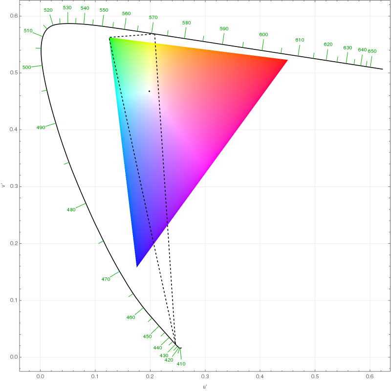

+++
date = '2021-03-03T12:29:08-06:00'
draft = false
title = 'Some random thoughts on RGB'
categories = ["General"]
+++

The thing about color is you think you know what it is, but when you start looking into it you realize that there’s so many layers that you can dive into. [This](https://xkcd.com/1882) xkcd sums it up nicely:  

Right now I’m at the three-ish primary colors mixed together phase. As it turns out, there’s quite a bit to learn here, since most of how “color” relates to computer monitors and such is based on this model. While I could describe the RYB and CMYK color spaces, I’ll focus on RGB (red, yellow and green) as it seems to be the most popular, and one of the more accurate in terms of modeling a mix of different colors of light.   

Some clarification on terms - color space is all the colors you can get from mixing some primary colors, while color gamut is how much of that color space a piece of hardware (e.g. a monitor) can produce.   

The RGB space uses additive color mixing, where you add the $ [r,g,b] $ values together (e.g. $[20,0,100]$ combined with $[10,10,40]$ would be $[30,10,140]$).  

The way you perceive colors is through the cone cells in your eye (the rods are for detecting brightness/movement). The three types of cone cells -  long, medium, and short - respond most strongly to yellow, green, and violet light respectively. The difference in how strongly the cone cells react is how you differentiate colors.  

That begs the question - Why would one choose RGB when a color model based on yellow/green/violet would make a color system with more easily differentiable colors? The primary reason is that a YGV color space is more limited compared to one based on RGB. Look at this graph from [this stackoverflow answer](https://physics.stackexchange.com/questions/487799/why-does-the-additive-color-model-use-red-green-and-blue-instead-of-yellow-gre):   

 
The colored triangle is all the colors that can be made with RGB (aka RGB’s color space), while the dotted triangle is the one with our hypothetical YGV area. By the way, this is mapped on the CIELUV color space which I’ll talk about in just a bit.  

There’s another interesting reason why violet in particular would be a bad choice. Its luminous efficacy (the relative efficiency to generate a certain color of light) is 7 times as low as, say, blue (0.74 vs. 0.12). So in fact RGB was not only a choice of color gamut, but also of power efficiency!  

Up until this point we’ve been defining colors by their names. But what exactly does “red” mean? This brings us, like many things, to standards. I’ll probably write a whole blog post on just standards at some point, but for now I’ll just give a fun little link to *[an entire wikipedia article on different color space standards based on the RGB color model.](https://en.wikipedia.org/wiki/RGB_color_space)*  

To properly define these spaces, we need to learn about the mother of all color spaces - CIE XYZ color space. This is a more comprehensive one than RGB, where it combines the actual wavelength distributions of light with our perception of color. The color space of the graph above, CIELUV, is a color space which is simple to transform to and from CIE XYZ, but where distances more closely relate to perceptual difference in color.   

I want to define one of the RGB color standards, sRGB, but one more quick side tangent - who exactly is CIE? That would be the International Commission on Illumination (or in French, Commission internationale de l'éclairage). It’s fascinating to think that the world has come to a point where we have an entire international commission on the subject of illumination, which itself has 6 active divisions dedicated to topics from the physical measurement of light to photobiology and photochemistry. And this isn’t some brand-new organization - it was founded in 1900!  

But back to sRGB. We now have a way to map colors to something anyone can measure - the wavelength distributions of a particular color, now mapped to x/y/z coordinates. The sRGB color scale is a linear transformation of CIE XYZ based on D65, an international standard on what “standard illumination conditions at open-air” would be.  

First, the CIE XYZ grid is scaled so that the color of D65 would be mapped to X, Y, Z = 0.9505, 1.0000, 1.0890 - basically all 1’s. Next, we need to do a linear transformation of this space (for more info on what that means, check out the wonderful series by the channel 3Blue1Brown [here](https://www.3blue1brown.com/essence-of-linear-algebra-page).) This is done with matrix multiplication as shown here:
$$
\begin{bmatrix}R\_{linear}\\\\G\_{linear}\\\\B\_{linear}\end{bmatrix}=\begin{bmatrix}+3.24096994 & -1.53738318 & -0.49861076\\\\-0.96924364 & +1.8759675 & +0.04155506\\\\ +0.05563008 & -0.20397696 & +1.05697151\end{bmatrix}\begin{bmatrix}X\_{D65}\\\\Y\_{D65}\\\\Z\_{D65}\end{bmatrix}
$$
We have one more step to go - gamma correction, i.e. fixing the brightness. Here, if the RGB values we have are too small (<0.0031308) we multiply it by 12.92. Otherwise, we do this raise it to the (1/2.4) power, multiply it by 1.055, and subtract 0.055 from it. Where did these numbers come from? Well, that’s a bunch of math that isn’t really relevant to this blog post, but [here](https://en.wikipedia.org/wiki/SRGB#Theory_of_the_transformation ) you can find a more detailed explanation. 

