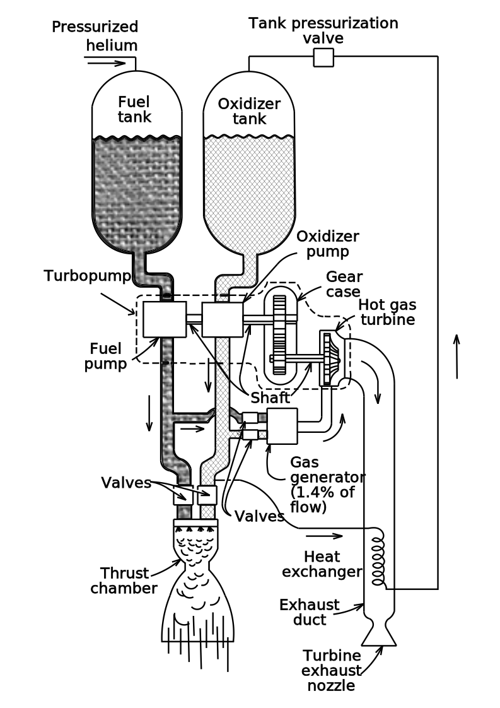

+++
date = '2026-03-19T10:38:00-06:00'
draft = false
title = 'Rocket Propulsion Elements Book Notes'
categories = ["Rocketry"]
+++

This post is a compilation of the notes I've taken when reading the book [Rocket Propulsion Elements](https://www.amazon.com/Rocket-Propulsion-Elements-George-Sutton/dp/1118753658) by George Sutton. Please note that this won't cover everything the book writes about: I'm most interested in the design of pressure fed and pump-driven bipropellant liquid chemical rocket engines, so things like chapter 17 which covers electric propulsion will largely be ignored.

For equations, I'm planning on writing them in code since that makes it a little clearer to me.

All the units will be in the SI system of units.

# Chapter 1: Classification

Here's some typical values for rocket engines (the feature meanings will be explained later) (Table 1-2, p. 3):

| Feature        | Value           |
| ------------- |---------------|
| Thrust-to-weight ratio      | 75:1 |
| Specific fuel consumption (kg/hr-N), aka kg of fuel/hr per 1N thrust| 0.816-1.428      |
| Specific thrust (N/m^2), aka newtons of thrust per frontal area                          | 239.5k-1.1M   |
| Specific Impulse, thrust per unit of propellant per second                               | 270 sec       |
| Combustion Temperature                                                                   | 2500-4100 C   |
| Exhaust Velocities                                                                       | 1800-4300 m/s |

The "Thrust Chamber" is a reference to the injector, nozzle, and the combustion chamber itself.

Figures 1-3 and 1-4 (pages 6-7) show a high level diagram of a propulsion system for a pressure-fed and turbopump driven system respectively. Some components of note:

- Fuel filter: [Used for preventing debris from entering rocket](https://space.stackexchange.com/questions/65581/what-is-the-oxygen-filter-on-super-heavy-and-how-could-it-get-blocked-on-ift-3)
- [Regulators](https://en.wikipedia.org/wiki/Pressure_regulator): Controls the pressure coming from a high pressure tank to a lower one

Figure 1-4 (page 7) has a great diagram of a turbopump-driven propulsion system. I didn't like the image version I had, so I remade it as an svg here:

Selecting a propulsion type (among the many described) comes down to system performance, reliability, cost, propulsion system size, and compatibility (p. 14).

Determining the number of stages for a rocket comes down to the mission profile, number/types of maneuvers to make, propellant energy density, payload size, etc. (p 14).

Table 1-3 (p. 18) Has some specifications for the Delta IV heavy and Atlas V rockets:

| Vehicle            | Propulsion System Designation (Propellant) | Stage | No. of Propulsion Systems per Stage | Thrust (lbf/kN) per Engine/Motor       | Specific Impulse (sec) | Mixture Ratio, Oxidizer to Fuel Flow | Chamber Pressure (psia) | Nozzle Exit Area Ratio | Inert Engine Mass (lbm/kg) |
| ------------------ | ------------------------------------------ | ----- | ----------------------------------- | -------------------------------------- | ---------------------- | ------------------------------------ | ----------------------- | ---------------------- | -------------------------- |
| **DELTA IV HEAVY** | RS-68A (LOX/LH₂)                           | 1     | 1 or 3                              | 797,000 / 3548ᵃ                        | 411ᵃ                   | 5.97                                 | 1557                    | 21.5:1                 | 14,770 / 6,699             |
|                    | RL 10B-2 (LOX/LH₂)                         | 2     | 1                                   | 702,000 / 3123ᵇ,ᶜ  24,750/0.110ᵃ | 362ᵇ  279.3ᵃ     | 5.88                                 | 633                     | 285:01:00              | 664 lbm                    |
| **ATLAS V**        | Solid Booster                              | 0     | Between 1 and 5                     | 287,346 / 1.878ᵇ each                  | 279.3ᵇ                 | N/A                                  | 3722                    | 16:1ᶜ                  | 102,800 lbm (loaded)       |
|                    | RD-180ᵈ (LOX/Kerosene)                     | 1     | 1                                   | 933,400 / 4.151ᵃ                       | 310.7ᵇ                 | 2.72                                 | 610                     | 36.4:1                 | 12,081 / 5,480             |
|                    | RD 10A-4-2 (LOX/LH₂)                       | 2     | 1 or 2                              | 860,200 / 3.820ᵇ,ᶜ                     | 337.6ᵃ                 | 4.9–5.8                              |                         | 84.1:1                 | 5330 kg                    |
|                    |                                            |       |                                     | 22,300 / 99.19ᵃ                        | 450.5ᵃ                 | —                                    | —                       | —                      | 370 / 168                  |

ᵃ Vacuum value.  
ᵇ Sea-level value.  
ᶜ At ignition.  
ᵈ Russian RD-180 engine has 2 gimbal-mounted thrust chambers.

Thrust levels under 100 kg is called *Micropropulsion*.

# Chapter 2: Definitions and Fundamentals