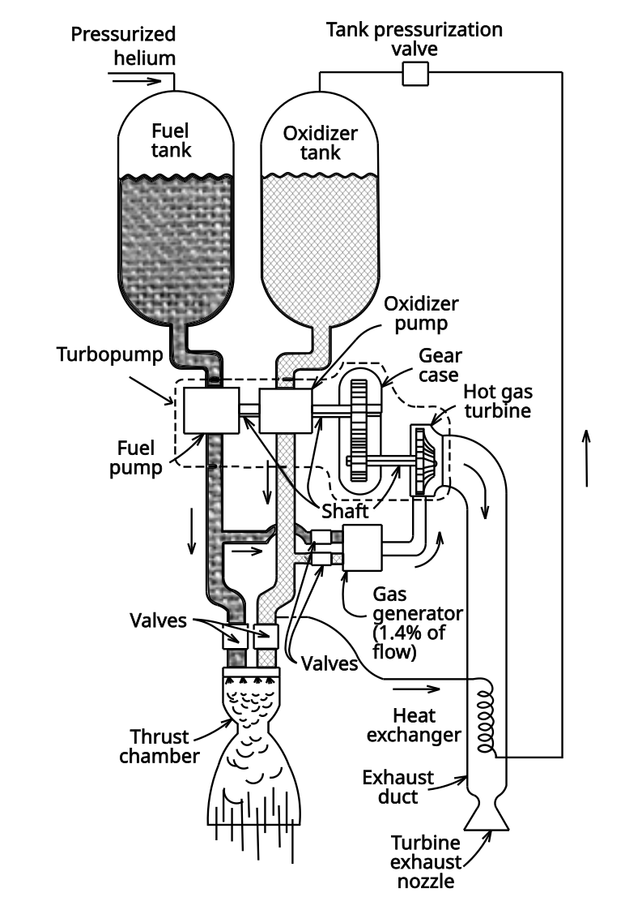
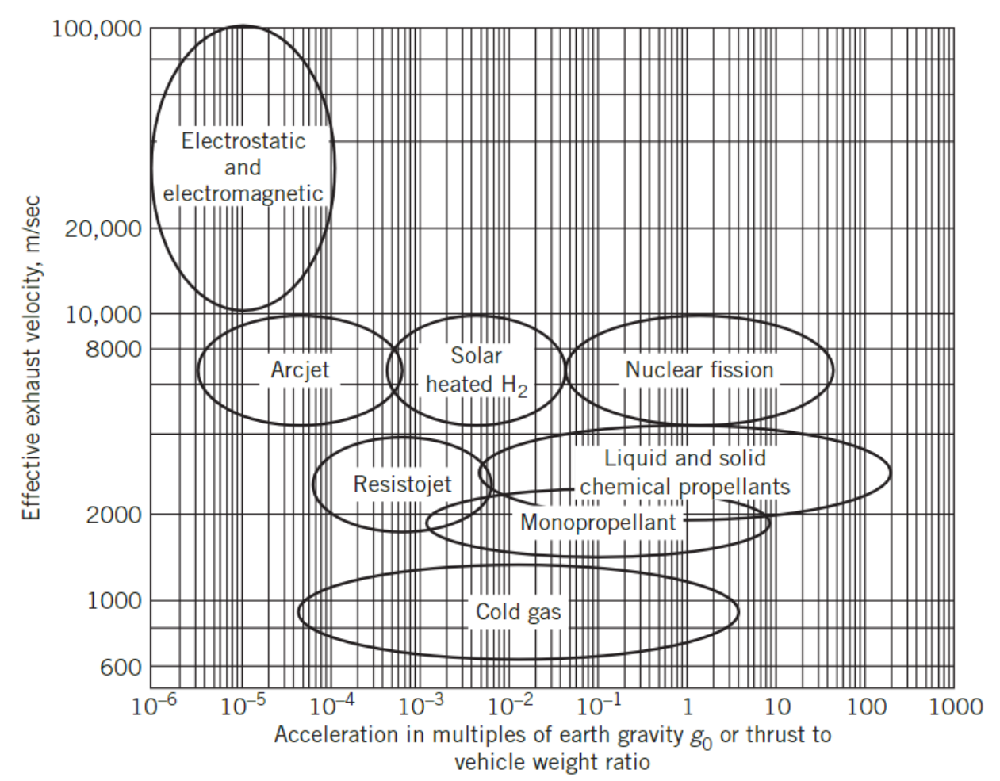

+++
date = '2026-03-19T10:38:00-06:00'
draft = false
title = 'Rocket Propulsion Elements Book Notes'
categories = ["Rocketry"]
+++

This post is a compilation of the notes I've taken when reading the book [Rocket Propulsion Elements](https://www.amazon.com/Rocket-Propulsion-Elements-George-Sutton/dp/1118753658) by George Sutton. *Please note* that this won't cover everything the book writes about: I'm most interested in the design of pressure fed/pump-driven bipropellant liquid chemical rocket engines for suborbital flight, so things like chapter 17 which covers electric propulsion will largely be ignored.

For equations, I'm planning on writing them in code since that makes it a little clearer to me.

I will, of course, try to only use SI units.

# Chapter 1: Classification

Here's some typical values for rocket engines (the feature meanings will be explained later) (Table 1-2, p. 3):

| Feature        | Value           |
| ------------- |---------------|
| Thrust-to-weight ratio      | 75:1 |
| Specific fuel consumption (kg/hr-N), aka kg of fuel/hr per 1N thrust| 0.816-1.428      |
| Specific thrust (N/m^2), aka newtons of thrust per frontal area                          | 239.5k-1.1M   |
| Specific Impulse, thrust per unit of propellant per second                               | 270 sec       |
| Combustion Temperature                                                                   | 2500-4100 C   |
| Exhaust Velocities                                                                       | 1800-4300 m/s |

The "Thrust Chamber" is a reference to the injector, nozzle, and the combustion chamber itself.

Figures 1-3 and 1-4 (pages 6-7) show a high level diagram of a propulsion system for a pressure-fed and turbopump driven system respectively. Some components of note:

- Fuel filter: [Used for preventing debris from entering rocket](https://space.stackexchange.com/questions/65581/what-is-the-oxygen-filter-on-super-heavy-and-how-could-it-get-blocked-on-ift-3)
- [Regulators](https://en.wikipedia.org/wiki/Pressure_regulator): Controls the pressure coming from a high pressure tank to a lower one

Figure 1-4 (page 7) has a great diagram of a turbopump-driven propulsion system. I didn't like the image version I had, so I remade it as an svg here:



Selecting a propulsion type (among the many described) comes down to system performance, reliability, cost, propulsion system size, and compatibility (p. 14).

Determining the number of stages for a rocket comes down to the mission profile, number/types of maneuvers to make, propellant energy density, payload size, etc. (p 14).

Table 1-3 (p. 18) Has some specifications for the Delta IV heavy and Atlas V rockets:


| Vehicle            | Propulsion System Designation (Propellant) | Stage | No. of Propulsion Systems per Stage | Thrust (lbf/kN) per Engine/Motor       | Specific Impulse (sec) | Mixture Ratio, Oxidizer to Fuel Flow | Chamber Pressure (psia) | Nozzle Exit Area Ratio | Inert Engine Mass (lbm/kg) |
| ------------------ | ------------------------------------------ | ----- | ----------------------------------- | -------------------------------------- | ---------------------- | ------------------------------------ | ----------------------- | ---------------------- | -------------------------- |
| **DELTA IV HEAVY** | RS-68A (LOX/LH₂)                           | 1     | 1 or 3                              | 797,000 / 3548ᵃ                        | 411ᵃ                   | 5.97                                 | 1557                    | 21.5:1                 | 14,770 / 6,699             |
|                    | RL 10B-2 (LOX/LH₂)                         | 2     | 1                                   | 702,000 / 3123ᵇ,ᶜ<br><br>24,750/0.110ᵃ | 362ᵇ<br><br>279.3ᵃ     | 5.88                                 | 633                     | 285:01:00              | 664 lbm                    |
| **ATLAS V**        | Solid Booster                              | 0     | Between 1 and 5                     | 287,346 / 1.878ᵇ each                  | 279.3ᵇ                 | N/A                                  | 3722                    | 16:1ᶜ                  | 102,800 lbm (loaded)       |
|                    | RD-180ᵈ (LOX/Kerosene)                     | 1     | 1                                   | 933,400 / 4.151ᵃ                       | 310.7ᵇ                 | 2.72                                 | 610                     | 36.4:1                 | 12,081 / 5,480             |
|                    | RD 10A-4-2 (LOX/LH₂)                       | 2     | 1 or 2                              | 860,200 / 3.820ᵇ,ᶜ                     | 337.6ᵃ                 | 4.9–5.8                              |                         | 84.1:1                 | 5330 kg                    |
|                    |                                            |       |                                     | 22,300 / 99.19ᵃ                        | 450.5ᵃ                 | —                                    | —                       | —                      | 370 / 168                  |

ᵃ Vacuum value.  
ᵇ Sea-level value.  
ᶜ At ignition.  
ᵈ Russian RD-180 engine has 2 gimbal-mounted thrust chambers.

Thrust levels under 100 kg is called *Micropropulsion*.

# Chapter 2: Definitions and Fundamentals

**Mass flow rate ($F/\dot m$, kg/s)**: How much propellant is expelled per second

- At sea level, it's also the rate of weight change / $g_0$
- For multiple thrusters: the total mass flow rate is just the sum of the individual mass flow rates of each engine. For turbopump engines, include the mass through the turbine exhaust too!

**Thrust ($F$, N)**: The force the propulsion system exerts on the rocket. Measured in Newtons.

- Can be found via: F = $\dot m v_2$, where $v_2$ is the relative exhaust velocity at the nozzle. Assumes exit pressure == ambient pressure and constant exit velocity.
- More accurate version: $F = \dot m v_2$ + (exit pressure - ambient pressure) x nozzle exit area
- Based on the above equation, we see that the thrust is maximized when ambient pressure is 0 - aka, a vacuum! Thrust generally improves 10-30% over sea level. 
- **Pressure thrust** is the second part of the accurate equation. Negative pressure thrust is bad, so design your exit pressure to be higher than ambient pressure. **Momentum thrust** is the term for the first part ($\dot m v_2$)
- For multiple thrusters: the total force is just the sum of the individual forces produced by each engine

**Total Impulse ($I_t$, Ns)**: Area under the force/time graph. Also equivalent to change in momentum. Measured in Newton-seconds.

- How it's measured: Measure the thrust/force via a load cell in a static fire, then find the area under that graph.

**Specific Impulse ($I_s$, s):** Total impulse / (expelled mass x 9.806m/s^2)

- Measure of a rocket's efficiency, a la miles per gallon
- How it's measured: For an overall specific impulse just measure the rocket before and after to get the overall propellant mass used. For instantaneous specific impulse, measure the instantaneous mass flow rate (easiest for liquid rocket engines).
- The $g$ constant (9.806 m/s^2) is mostly just there to make the units seconds for use across measurement systems.
- For multiple engines: Overall force / (Overall mass flow rate x $g_0$)


**Average Exit Velocity ($c$, m/s)**: $I_s g_0$

- The actual exhaust velocity is hard to measure, and can vary over the nozzle exit area, so we assume it's uniform and calculate it via equations.
- Also calculated via: $F/\dot m$ assuming constant thrust
- Since it only differs from $I_s$ by a constant, it can also be used to measure efficiency
- The **effective exhaust velocity** is a more accurate version: $c = v_2 + (p_2 - p_3)A_2 / \dot m = I_s g_0$, where $v_2$ is the relative exit velocity at the nozzle. The second part is usually small though, so it's pretty similar to the actual exhaust velocity.

**Characteristic Velocity ($c^*$):** (chamber pressure x throat area) / mass flow rate

- Used for comparison different propulsion systems & propellant choice, since it's not dependent on the nozzle geometry.

**Mass Ratio ($MR$)**: final mass ($m_f$) / loaded-on-pad mass ($m_0$)

**Propellant Mass Fraction** ($\zeta$): useable propellant mass ($m_p$) / pre-launch propulsion system mass ($m_0$)

- Values closer to 1 are better (means more of the rocket's mass is propellant)
- $m_0$ doesn't include non-propulsion mass, e.g. payload or guidance.

**Impulse to weight ratio**: Total Impulse / loaded-on-pad *weight*

- Higher value == more efficient design

**Thrust to weight ratio (TWR)**: Thrust force / *weight*

- Used for seeing how fast the rocket gets off the pad (or if it does at all, must be > 1)
- We use weight since the context is planet-dependent
- Maximum TWR occurs right before burnout, i.e. running out of fuel

**Optimum Expansion Ratio**: When the exit pressure is equal to ambient pressure. The nozzle / throat area ratio is usually designed so that the optimum expansion happens at or above sea level.

**Specific Volume**: The volume divided by the mass inside. Usually a graph across the nozzle pressure.

**Power transmitted to the vehicle**: $F$ x Vehicle velocity

**Internal Efficiency ($\eta_{int}$)**: = jet kinetic energy / avaliable chemical power

$$
\frac{\frac{1}{2}\dot m v^2}{\eta_{comb}P_{chem}}
$$

- The fraction of available chemical power turned into kinetic energy in the exhaust

**Propulsive efficiency**: (Power transmissted to vehicle) / (Power transmitted to vehicle + residual kinetic jet power)

- Maximized when the vehicle velocity equals the exhaust velocity, making the exhaust "stand still" in space - think of the Mythbusters backwards soccer cannon on a truck. 
- Specific Impulse covers this kind of efficiency already?

Typical vehicle TWRs to effective exhaust velocities (Figure 2-4, p. 39):



Engines are generally throttled down to avoid excessive aerodynamic pressure on the vehicle on ascent (usually around Max-Q, the point of max aerodynamic pressure). They're also throttled down for landing.


# Chapter 3: Nozzle Theory and Thermodynamic Relations

For the equations in this section, the following assumptions are made: corrective factors are described later in the book and a summary of the non-ideal behaviors is in 3.5:

- The working fluid is homogenous, gaseous, and obeys the [perfect gas law](https://chem.libretexts.org/Bookshelves/Physical_and_Theoretical_Chemistry_Textbook_Maps/Supplemental_Modules_(Physical_and_Theoretical_Chemistry)/Physical_Properties_of_Matter/States_of_Matter/Properties_of_Gases/Gas_Laws/The_Ideal_Gas_Law). Rocket injectors are pretty good at mixing, so a good assumption. Also, temperatures are high enough that gases generally behave ideally.
- No heat transfer/fraction with the walls, meaning the flow is [adiabatic](https://energyeducation.ca/encyclopedia/Adiabatic). Aside for small chambers, heat losses are less than 1-2%.
- No disturbances in the flow rate, including no shock waves/discontinuities. 
- Start up/shutdown times are negligable.
- The exhaust gases are parallel to the nozzle axis, and the velocity/pressure/temperature/density are uniform normal/perpendicular to the nozzle axis. You can use a conical exit with a 15 degree half angle to account for non-parallel exhaust gas.
- Propellants are at ambient temperature, except for cryogenic propellants stored at boiling point.

The goal of rocket nozzle design is to convert as much of the energy in the combustion gas into directed kinetic energy. The available energy a unit mass of gas has, aka its total/stagnation enthalpy per unit mass, is its [enthalpy](https://physics.stackexchange.com/questions/356412/what-does-enthalpy-mean/356432#356432) `h` plus its kinetic energy:

$$
h\_0 = h + \frac{v^2}{2} = u + \frac{p}{\rho}+\frac{v^2}{2}
$$

Where $u$ is the internal energy, $p/\rho$ is the work energy per unit mass, and $v$ is velocity.

The ratio between the pressure and volume for a specific mass of combustion gas ($c\_p / c\_v$) is called the specific heat ratio $k$. It's constant for a wide range of temperatures.


### Example 3-1.

Say we have propellants whose combustion gas has a specific heat ratio of 1.3, and a known exit Mach number of 2.52. For optimum expansion, i.e. where the exit pressure matches atmospheric (0.1013 MPa), then the ideal chamber pressure is the total stagnation pressure (eq. 3-13, p 73):

```python
def chamber_pressure(p_exit: pressure, M_exit: mach, k: spec_heat_ratio):
    return p_exit * (1 + 0.5 * (k-1) * M_exit ** 2) ** (k / (k-1))
```

So we get 1.84 MPa. We can also get the ideal nozzle area ratio (nozzle exit area / nozzle throat area) via eq. 3-14 on page 74:

```python
def y_to_x_nozzle_area_ratio(m_x: mach, m_y: mach, k: spec_heat_ratio):
    part_1 = m_x / m_y
    part_2 = ((1+((k-1)/2) * m_y**2) / (1+((k-1)/2) * m_x**2)) ** ((k+1) / (k-1))
    return part_1 * sqrt(part_2)
```

Assuming a large chamber cross section to throat ratio and a chamber temperature close to stagnation temperature, we get a simplified but widely used equation for the exit velocity (eq 3-16, p 76):

```python
def exit_velocity(k: spec_heat_ratio, R: gas_constant, T_chamber: temperature, p_exit: pressure, p_chamber: pressure):
    part_1 = 2*k / (k-1)
    part_2 = (R * T_chamber)
    part_3 = 1 - (p_exit / p_chamber) ** ((k-1) / k)
    return sqrt(part_1 * part_2 * part_3)

# Alternatively:

def exit_velocity(k: spec_heat_ratio, R_prime: universal_gas_constant, T_combustion: temperature, M_molecular: mass, p_exit: pressure, p_chamber: pressure):
    part_1 = 2*k / (k-1)
    part_2 = (R_prime * T_combustion) / M_molecular
    part_3 = 1 - (p_exit / p_chamber) ** ((k-1) / k)
    return sqrt(part_1 * part_2 * part_3)

```

Using the equations for specific impulse, we can see that any increase in combustion temperature or decrease in molecular mass improves `part_2`, meaning exhaust velocity increases, meaning specific impulse increases. Improving chamber pressure or reducing exit pressure also improves specific impulse.

Comparing specific impulse between different designs requires standardizing chamber and exit pressure: 1000 psia chamber and 1atm exit pressures are usually used.

The ideal exhaust velocity only matches $c\_{opt}$ when the exit pressure matches ambient pressure.

The maximum theoretical exit velocity, assuming an infinite nozzle expansion into a vacuum, is (eq 3-18, p. 78):

```python
def max_exit_velocity(k: spec_heat_ratio, R_gas: gas_constant, T_combustion: temperature):
    return sqrt((2 * k * R_gas * T_combustion) / (k - 1))
```

Besides the ambient pressure/infinite nozzle assumptions, this is theoretical since at some point the gas will liquify and stop expanding.

### Example 3-2 (p. 78)

See FIgure 3-3 on page 80 for sample results of the function.
```python
def pressure_temp_input_to_engine_properties(p_chamber: pressure, t_chamber: temperature, prop_consum_rate: kg_per_sec, k: spec_heat_ratio, R_gas: gas_constant, p_ambient_design: pressure, pressure_step: pressure):
    effective_exit_v = exit_velocity(k, R, t_chamber, p_ambient_design, p_chamber)
    ideal_specific_impulse = effective_exit_v / G_0
    ideal_thrust = prop_consum_rate * effective_exit_v

    start_specific_volume = (R * t_chamber) / p_chamber # From ideal gas law

    # Graphs are vs the pressure over the nozzle from combustion to 
    volume_graph = []
    temperature_graph = []
    velocity_graph = []
    area_graph = []
    mach_graph = []

    for pressure in range(p_chamber, p_ambient_design, pressure_step):
        volume = start_specific_volume * (p_chamber / pressure) ** (1/k)
        velocity = exit_velocity(k, R, t_chamber, pressure, p_chamber)
        temperature = t_chamber * (pressure / p_chamber) ** ((k-1/k))
        volume_graph.push(pressure, volume)
        temperature_graph.push(pressure, )
        velocity_graph.push(pressure, velocity)
        area_graph.push(pressure, (prop_consum_rate * (volume)) / velocity)
        mach_graph.push(pressure, velocity / sqrt(k * R * temperature))


    return ideal_specific_impulse, ideal_thrust, area_graph, velocity_graph, volume_graph, temperature_graph, mach_graph
```

The **nozzle expansion area ratio** $\epsilon$ is the nozzle exit area / throat area.

The **critical pressure** is the throat pressure where the flow rate attains its maximum. It's given as throat pressure / combustion chamber pressure. It's usually around 0.53 to 0.57. If the real pressure ratio exceeds the critical pressure, the flow rate is less than its maximum.

```python
def critical_pressure(k: spec_heat_ratio):
    return (2/(k+1)) ** (k/(k-1))
```

Given the throat is at critical pressure, we can find the theoretical specific volume and temperature:

```python
def crit_pressure_throat_volume(V_combustion: volume, k: spec_heat_ratio):
    return V_combustion * ((k+1) / 2) ** (1/(k-1))

def crit_pressure_throat_temp(T_combustion: temperature, k: spec_heat_ratio):
    return (2 * T_combustion) / (k + 1)

def crit_pressure_throat_velocity(k: spec_heat_ratio, R: gas_constant, T_throat: temperature):
    return sqrt(k * R * T_throat) # equal to the speed of sound!
```

Nozzles must be designed such that the ratio between the inlet and exit pressures of the nozzle is high enough to make the divergent section supersonic. Meaning, the chamber pressure must be above roughly 1.78 times that of the exit!

Since mass flow in must equal mass flow out, the mass flow rate at any cross section (including a choked throat) is just `(Area * velocity) / specific volume` (eq. 3-24, p 83).

## 3.5: Real Nozzles
Actual nozzle performance is usually 1-6% less than ideal. General practice is to start with the mathematically ideal nozzle shape and use experimental data to correct it later. You could also use more advanced Algorithms (TM) that take into account:
- (TODO: List here)